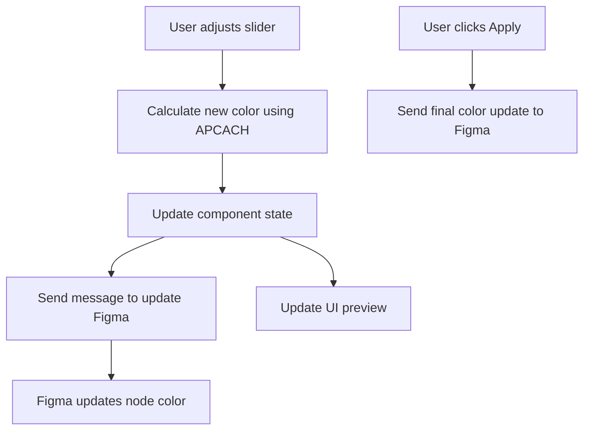

# Ultimate Implementation Plan: Color Adjustment Sliders for Polychrom

Based on the analysis of previous messages, here's a cohesive, comprehensive plan for implementing the color adjustment sliders feature.

## 1. Overview

We'll add three sliders (APCA, chroma, hue) to the Polychrom plugin that:
- Integrate with Figma's design system
- Respect theming
- Update colors in real-time both in the UI and in Figma
- Reuse existing background detection logic
- Maintain the plugin's visual consistency

## 2. Component Structure

### New Component
```
src/ui/components/ColorAdjustmentSliders.tsx
```

This component will:
- Display three sliders for adjusting APCA, chroma, and hue
- Show current values and previews
- Include an "Apply" button to finalize changes
- Style consistently with Figma's design system

### Integration Point
Add to the `Selection.tsx` component when in large size mode.

## 3. Data Flow



## 4. Implementation Steps

### Step 1: Add New Message Types
```typescript
// src/types/messages.ts
export enum MessageTypes {
  // Existing types...
  UpdateNodeColor = 'Polychrom_UpdateNodeColor',
}

export interface UpdateNodeColorPayload {
  nodeId: string;
  color: {
    hex: string;
    oklch: {
      l: number;
      c: number;
      h: number;
      alpha?: number;
    };
  };
  isPreview: boolean;
}
```

### Step 2: Create Color Adjustment Component
```typescript
// src/ui/components/ColorAdjustmentSliders.tsx

import { type ApcachColor, apcach, apcachToCss, crTo, maxChroma } from 'apcach';
import { ThemeVariablesKeys } from './ThemeVariablesProvider.tsx';
import React, { useState, useEffect } from 'react';
import { type ContrastConclusion } from '~ui/types';
import { MessageTypes } from '~types/messages.ts';
import { ColorIndicator } from './ColorIndicator.tsx';

interface ColorAdjustmentSlidersProps {
  nodeId: string;
  fg: ContrastConclusion['fg'];
  bg: ContrastConclusion['bg'];
  apca: number;
  onColorChange: (newFg: ContrastConclusion['fg'], newApca: number) => void;
}

export const ColorAdjustmentSliders: React.FC<ColorAdjustmentSlidersProps> = ({
  nodeId,
  fg,
  bg,
  apca,
  onColorChange
}) => {
  const [targetApca, setTargetApca] = useState<number>(Math.abs(apca));
  const [fgHue, setFgHue] = useState<number>(fg.oklch.h || 0);
  const [fgChroma, setFgChroma] = useState<number>(fg.oklch.c || 0);
  const [chromaMax, setChromaMax] = useState<number>(maxChroma(fg.oklch.l));

  // Reset values when input changes
  useEffect(() => {
    setTargetApca(Math.abs(apca));
    setFgHue(fg.oklch.h || 0);
    setFgChroma(fg.oklch.c || 0);
    setChromaMax(maxChroma(fg.oklch.l));
  }, [fg, bg, apca]);

  // Calculate new color based on slider values
  const updateColor = (hue: number, chroma: number, targetApca: number) => {
    try {
      // Generate config using existing background and target APCA
      const contrastConfig = crTo(bg.hex, targetApca);
      
      // Create new color with desired parameters
      const newApcachColor = apcach(
        contrastConfig,
        chroma,
        hue,
        fg.oklch.alpha
      );
      
      // Convert to hex
      const newHex = apcachToCss(newApcachColor, 'hex');
      
      // Create new foreground color
      const newFg = {
        hex: newHex,
        isBlended: fg.isBlended,
        oklch: {
          mode: 'oklch' as const,
          l: newApcachColor.lightness,
          c: newApcachColor.chroma,
          h: newApcachColor.hue,
          alpha: newApcachColor.alpha
        }
      };
      
      // Preserve sign of original APCA value
      const newApca = targetApca * (apca < 0 ? -1 : 1);
      
      // Update UI
      onColorChange(newFg, newApca);
      
      // Send update to Figma
      parent.postMessage({
        pluginMessage: {
          type: MessageTypes.UpdateNodeColor,
          payload: {
            nodeId,
            color: {
              hex: newHex,
              oklch: newFg.oklch
            },
            isPreview: true
          }
        }
      }, '*');
    } catch (error) {
      console.error('Failed to update color:', error);
    }
  };

  // Event handlers for sliders
  const handleApcaChange = (e: React.ChangeEvent<HTMLInputElement>) => {
    const newApca = parseFloat(e.target.value);
    setTargetApca(newApca);
    updateColor(fgHue, fgChroma, newApca);
  };

  const handleHueChange = (e: React.ChangeEvent<HTMLInputElement>) => {
    const newHue = parseFloat(e.target.value);
    setFgHue(newHue);
    updateColor(newHue, fgChroma, targetApca);
  };

  const handleChromaChange = (e: React.ChangeEvent<HTMLInputElement>) => {
    const newChroma = parseFloat(e.target.value);
    setFgChroma(newChroma);
    updateColor(fgHue, newChroma, targetApca);
  };

  // Handle apply button click
  const handleApply = () => {
    parent.postMessage({
      pluginMessage: {
        type: MessageTypes.UpdateNodeColor,
        payload: {
          nodeId,
          color: {
            hex: fg.hex,
            oklch: fg.oklch
          },
          isPreview: false
        }
      }
    }, '*');
  };

  return (
    <div 
      className="mt-4 p-3 rounded-lg"
      style={{
        backgroundColor: `var(${ThemeVariablesKeys.bg})`,
        borderWidth: '1px',
        borderColor: `var(${ThemeVariablesKeys.bgBorder})`,
      }}
    >
      <h3 
        className="text-xs font-medium mb-3"
        style={{ color: `var(${ThemeVariablesKeys.fg})` }}
      >
        Adjust Color
      </h3>

      {/* APCA Slider */}
      <div className="mb-3">
        <div className="flex justify-between items-center mb-1">
          <label 
            className="text-xxs font-medium"
            style={{ color: `var(${ThemeVariablesKeys.fg})` }}
          >
            APCA
          </label>
          <span 
            className="text-xxs"
            style={{ color: `var(${ThemeVariablesKeys.secondary})` }}
          >
            {targetApca.toFixed(0)}
          </span>
        </div>
        <input
          type="range"
          min="15"
          max="105"
          step="1"
          value={targetApca}
          onChange={handleApcaChange}
          className="w-full h-1 bg-gray-200 rounded-full appearance-none cursor-pointer"
          style={{
            backgroundColor: `var(${ThemeVariablesKeys.bgBorder})`,
          }}
        />
      </div>

      {/* Hue Slider */}
      <div className="mb-3">
        <div className="flex justify-between items-center mb-1">
          <label 
            className="text-xxs font-medium"
            style={{ color: `var(${ThemeVariablesKeys.fg})` }}
          >
            Hue
          </label>
          <span 
            className="text-xxs"
            style={{ color: `var(${ThemeVariablesKeys.secondary})` }}
          >
            {Math.round(fgHue)}°
          </span>
        </div>
        <input
          type="range"
          min="0"
          max="360"
          step="1"
          value={fgHue}
          onChange={handleHueChange}
          className="w-full h-1 bg-gray-200 rounded-full appearance-none cursor-pointer"
          style={{
            backgroundColor: `var(${ThemeVariablesKeys.bgBorder})`,
          }}
        />
      </div>

      {/* Chroma Slider */}
      <div className="mb-3">
        <div className="flex justify-between items-center mb-1">
          <label 
            className="text-xxs font-medium"
            style={{ color: `var(${ThemeVariablesKeys.fg})` }}
          >
            Chroma
          </label>
          <span 
            className="text-xxs"
            style={{ color: `var(${ThemeVariablesKeys.secondary})` }}
          >
            {Math.round(fgChroma * 100)}%
          </span>
        </div>
        <input
          type="range"
          min="0"
          max={chromaMax}
          step="0.01"
          value={fgChroma}
          onChange={handleChromaChange}
          className="w-full h-1 bg-gray-200 rounded-full appearance-none cursor-pointer"
          style={{
            backgroundColor: `var(${ThemeVariablesKeys.bgBorder})`,
          }}
        />
      </div>

      {/* Color Preview */}
      <div className="flex items-center justify-between mb-3">
        <ColorIndicator
          borderColor={ThemeVariablesKeys.fgBorder}
          fill={fg}
          indicatorColor={fg.hex}
          isBlended={fg.isBlended}
          textColor={ThemeVariablesKeys.fg}
        />
      </div>

      {/* Apply Button */}
      <button
        className="mt-1 px-3 py-1.5 text-xxs font-semibold rounded w-full transition-colors"
        style={{
          backgroundColor: `var(${ThemeVariablesKeys.fg})`,
          color: `var(${ThemeVariablesKeys.bg})`,
        }}
        onClick={handleApply}
      >
        Apply to Selection
      </button>
    </div>
  );
};
```

### Step 3: Update Selection Component
```typescript
// src/ui/components/Selection.tsx

// Add new imports
import { ColorAdjustmentSliders } from './ColorAdjustmentSliders.tsx';
import { useState } from 'react';

export const Selection = ({
  id,
  isLast,
  size,
  userSelection: { apca: initialApca, bg: initialBg, fg: initialFg },
}: Props): ReactElement => {
  // Existing state
  const [currentStyleNumber, setCurrentStyleNumber] = useState(
    SEGMENTED_FONT_STYLES.INITIAL
  );
  
  // New state for adjustable colors
  const [showAdjustments, setShowAdjustments] = useState(false);
  const [adjustedFg, setAdjustedFg] = useState(initialFg);
  const [adjustedApca, setAdjustedApca] = useState(initialApca);
  
  // Handler for style number change (existing)
  const handleCurrentStyleNumberChange = (): void => {
    const newStyleNumber = currentStyleNumber + 1;
    if (newStyleNumber > SEGMENTED_FONT_STYLES.MAX) {
      setCurrentStyleNumber(SEGMENTED_FONT_STYLES.INITIAL);
    } else {
      setCurrentStyleNumber(newStyleNumber);
    }
  };
  
  // New handler for color adjustments
  const handleColorChange = (newFg, newApca) => {
    setAdjustedFg(newFg);
    setAdjustedApca(newApca);
  };
  
  // Use adjusted colors for display
  const displayFg = adjustedFg || initialFg;
  const displayApca = adjustedApca || initialApca;

  if (isEmpty(displayApca)) {
    return <CantCalculateMessage />;
  }

  const uiColors = generateUIColors(
    { hex: displayFg.hex, oklch: displayFg.oklch },
    { hex: initialBg.hex, oklch: initialBg.oklch }
  );

  if (isEmpty(uiColors)) {
    return <CantCalculateMessage />;
  }

  return (
    <ThemeVariablesProvider theme={uiColors.theme}>
      <div
        className={clsx(
          'w-full rounded-2.5xl',
          size === 'small' && isLast === false && 'px-5 pb-8 pt-2',
          size === 'small' && isLast === true && 'px-5 py-3',
          size === 'large' && 'p-5'
        )}
        style={{
          backgroundColor: `var(${ThemeVariablesKeys.bg})`,
        }}
      >
        <SegmentedFontStyleDefinition
          currentStyleNumber={currentStyleNumber}
          id={id}
          primaryColor={uiColors.theme.fg}
          secondaryColor={uiColors.theme.secondary}
        />

        <SelectionContent
          apca={displayApca}
          bg={initialBg}
          fg={displayFg}
          id={id}
          isLast={isLast}
          onApcaDoubleClick={handleCurrentStyleNumberChange}
          size={size}
        />
        
        {/* Add toggle button for adjustments when in large mode */}
        {size === 'large' && (
          <>
            <button
              className="mt-3 text-xxs px-2 py-1 rounded"
              style={{ 
                color: `var(${ThemeVariablesKeys.fg})`,
                backgroundColor: `var(${ThemeVariablesKeys.bg})`,
                borderWidth: '1px',
                borderColor: `var(${ThemeVariablesKeys.fgBorder})`,
              }}
              onClick={() => setShowAdjustments(!showAdjustments)}
            >
              {showAdjustments ? 'Hide Adjustments' : 'Adjust Color'}
            </button>
            
            {/* Show adjustment sliders when toggled */}
            {showAdjustments && (
              <ColorAdjustmentSliders
                nodeId={id}
                fg={displayFg}
                bg={initialBg}
                apca={displayApca}
                onColorChange={handleColorChange}
              />
            )}
          </>
        )}
      </div>
    </ThemeVariablesProvider>
  );
};
```

### Step 4: Create Node Color Update Service
```typescript
// src/api/services/figma/update-node-color.ts

import { type FigmaPaint } from '~types/figma.ts';

export const updateNodeColor = (
  nodeId: string,
  color: { hex: string; oklch: any },
  isPreview: boolean = false
): void => {
  try {
    // Find node by ID
    const nodes = figma.currentPage.findAll(node => node.id === nodeId);
    
    if (nodes.length === 0) {
      console.error('Node not found:', nodeId);
      return;
    }
    
    const node = nodes[0];
    
    // Check if node has fills property
    if ('fills' in node) {
      // Convert hex to RGB
      const r = parseInt(color.hex.slice(1, 3), 16) / 255;
      const g = parseInt(color.hex.slice(3, 5), 16) / 255;
      const b = parseInt(color.hex.slice(5, 7), 16) / 255;
      
      // Get current fills
      const fills = [...node.fills] as FigmaPaint[];
      
      // Find the first solid fill
      const solidFillIndex = fills.findIndex(
        fill => fill.type === 'SOLID' && fill.visible !== false
      );
      
      if (solidFillIndex !== -1) {
        // Create a new fills array with the updated color
        const newFills = [...fills];
        newFills[solidFillIndex] = {
          ...newFills[solidFillIndex],
          color: { r, g, b },
        };
        
        // Apply the updated fills
        node.fills = newFills;
        
        // Notify if this is a final (non-preview) update
        if (!isPreview) {
          figma.notify('Color updated');
        }
      }
    }
  } catch (error) {
    console.error('Failed to update node color:', error);
  }
};
```

### Step 5: Update API Message Handler
```typescript
// src/api/index.ts

// Update plugin dimensions
figma.showUI(__html__, {
  height: 340, // Increased height to accommodate sliders
  themeColors: true,
  width: 328,
});

// Add to message handler
figma.ui.onmessage = (message: MessagePayload<any>) => {
  // Existing handlers
  if (message.type === MessageTypes.ColorSpaceDisplayModeChange) {
    void figma.clientStorage.setAsync(
      ClientStorageKeys.savedColorSpaceDisplayMode,
      message.payload.colorSpaceDisplayMode
    );
  }

  if (message.type === MessageTypes.UiReady) {
    sendSavedColorSpaceDisplayMode();
  }
  
  // New color update handler
  if (message.type === MessageTypes.UpdateNodeColor) {
    updateNodeColor(
      message.payload.nodeId,
      message.payload.color,
      message.payload.isPreview
    );
  }
};
```

## 5. CSS for Slider Styling

Add these styles to ensure sliders match Figma's design system:

```css
/* Add to style.css */
input[type=range] {
  -webkit-appearance: none;
  height: 4px;
  border-radius: 2px;
}

input[type=range]::-webkit-slider-thumb {
  -webkit-appearance: none;
  height: 12px;
  width: 12px;
  border-radius: 50%;
  background-color: var(--slider-thumb-color, var(--fg));
  cursor: pointer;
  transition: transform 0.1s ease;
  transform-origin: center;
}

input[type=range]::-webkit-slider-thumb:hover {
  transform: scale(1.1);
}

input[type=range]:focus {
  outline: none;
}
```

## 6. Testing Plan

1. **Basic Functionality**:
   - Verify sliders update colors in real-time
   - Test all three sliders (APCA, hue, chroma)
   - Verify changes are applied to Figma selection

2. **Theme Testing**:
   - Test in both light and dark Figma themes
   - Ensure all UI elements remain visible and usable

3. **Edge Cases**:
   - Test with extreme values (min/max)
   - Test with multiple selections
   - Test with different types of Figma elements

## 7. Final Integration Steps

1. Update the plugin height in manifest.json if needed
2. Ensure all imports and module references are correct
3. Test with real Figma designs
4. Verify theme compatibility in both light and dark mode
5. Optimize performance for larger Figma files

This comprehensive plan integrates color adjustment sliders into the Polychrom plugin while maintaining its design integrity, leveraging Figma's design system, and providing real-time updates to both the UI and Figma selections. The implementation reuses existing background detection logic and adapts seamlessly to theme changes.
